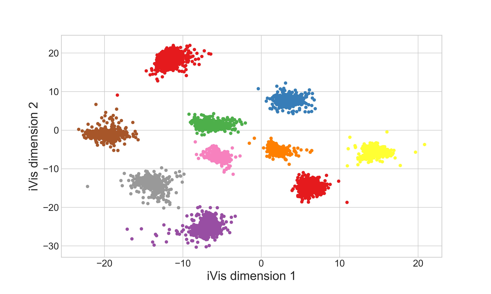

# ivis

Implementation of the ivis algorithm as described in the paper 'Structure-preserving visualisation of high dimensional single-cell data with deep Siamese Neural Networks'.  

This algorithm uses a siamese neural network trained on triplets to reduce the dimensionality of data to two dimensions for visualization. Each triplet is sampled from one of the <i>k</i> nearest neighbours as approximated by the Annoy library, with neighbouring points being pulled together and non-neighours being pushed away.

## Installation

After cloning this repo run: `pip install -e .` from the root of the project.

## Examples

Ivis can be run in both unsupervised and supervised mode. To run in supservised mode, simply provide an array of labels to the .fit() method.

### Unsupervised embeddings

```
from ivis import Ivis
from sklearn import datasets

iris = datasets.load_iris()
X = iris.data
y = iris.target

model = Ivis(embedding_dims=2, k=15)

embeddings = model.fit_transform(X)
```

Plotting the embeddings results in the following visualization:


### Supervised embeddings

```
from keras.datasets import mnist
import numpy as np
from ivis import Ivis

(x_train, y_train), (x_test, y_test) = mnist.load_data()
x_test = np.reshape(x_test.astype('float32'), (len(x_test), 28 * 28))


model = Ivis()
embeddings = model.fit_transform(x_test, y_test)
```



ivis is free for non-commercial use. If you have any questions, please send queries to info "at" beringresearch.com

Copyright 2018 Bering Limited
