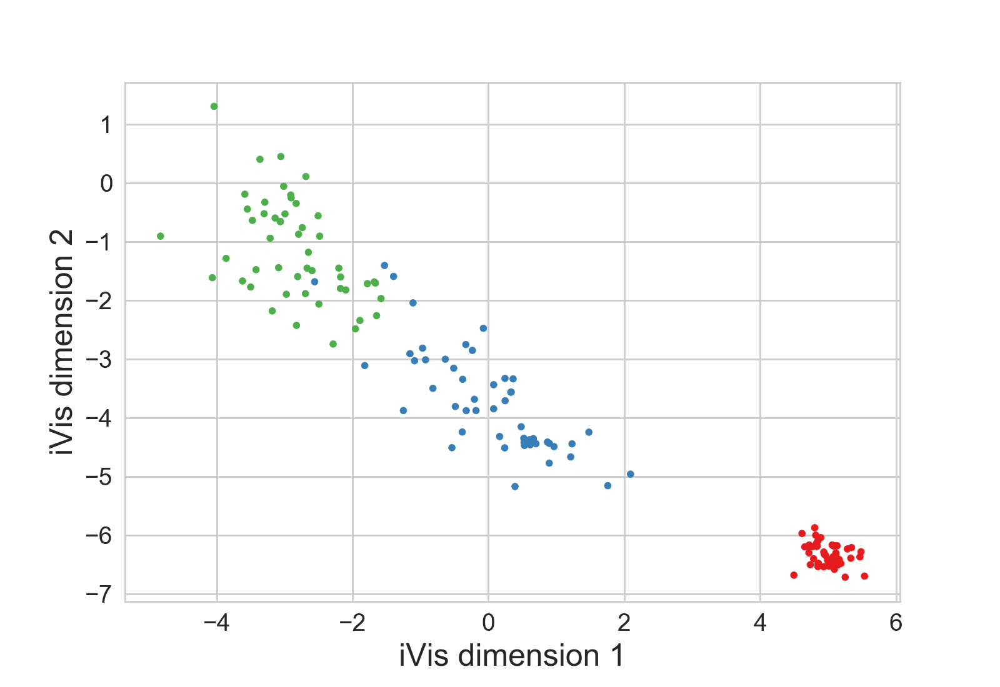

# ivis

Implementation of the ivis algorithm as described in the paper 'Structure-preserving visualisation of high dimensional single-cell data with deep Siamese Neural Networks'.  

This algorithm uses a siamese neural network trained on triplets to reduce the dimensionality of data to two dimensions for visualization. Each triplet is sampled from one of the <i>k</i> nearest neighbours as approximated by the Annoy library, with neighbouring points being pulled together and non-neighours being pushed away.

## Installation

After cloning this repo run: `pip install -r requirements.txt --editable .` from the root of the project.

## Examples

### Unsupervised embeddings

```
from ivis import Ivis
from sklearn import datasets

iris = datasets.load_iris()
X = iris.data

model = Ivis(embedding_dims=2, k=15)

embeddings = model.fit_transform(X)
```

Plotting the embeddings results in the following visualization:



### Training an a .h5 dataset

Load the data using a HDF5Matrix object provided by keras.  

When training on a .h5 file, it is suggested 
to set 'shuffle_mode' to 'batched' in order to prevent shuffling the whole .h5 dataset, which would be time-consuming 
to process due to the design of .h5 files.

```
from keras.utils.io_utils import HDF5Matrix

X_train = HDF5Matrix('test.h5', 'my_data')

ivis = Ivis()
ivis.fit(X_train, shuffle_mode='batch')

y_pred = ivis.transform(X_train)
```


Supervised version of ivis is available at https://github.com/beringresearch/ivis-supervised


ivis is free for non-commercial use. If you have any questions, please send queries to info "at" beringresearch.com

Copyright 2018 Bering Limited
