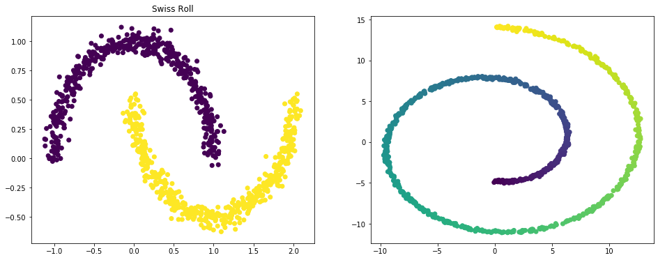
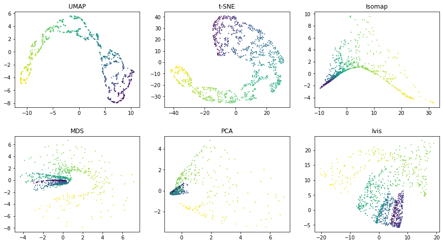

.. _comparisons:

Comparing ivis with other dimensionality reduction algorithms
=============================================================

Ivis aims to reduce data dimensionality whilst preserving both global
and local structures. There are a number of real-world applications
where this feature could be useful. For example:

-  Anomaly detection
-  Biological interpretation of high-throughput experiments
-  Feature extraction

Several algorithms have been proposed to address the problem of
dimensionality reduction, including
`UMAP <https://umap-learn.readthedocs.io/en/latest/>`__ and
`t-SNE <https://lvdmaaten.github.io/tsne/>`__. UMAP in particular, has
been succesfully applied in machine learning pipelines. Ivis is
different to these approaches in several ways.

First, ivis does not make any assumptions as to the inherent structure
of the dataset. For example, we don't need to know whether the data is
uniformly distributed on Riemannian manifold. Second, ivis is designed
to handle both small and extremely large datasets. Ivis performs well on
toy datasets such as the *iris* dataset, and scales linearly to datasets
with millions of observations. Finally, ivis prioritises interpretation
over visual apperance - this is accomplished by imposing meaning to
distances between points in the embedding space. As such, ivis does not
create spurious clusters nor does it artificially pack clusters closer
together. Embeddings aim to be true to the original structure of the
data, which can be noisy in a real-world setting.

.. code:: python3

    import umap
    import matplotlib.pyplot as plt
    
    from sklearn.preprocessing import PolynomialFeatures, MinMaxScaler
    
    from sklearn.manifold import TSNE, Isomap, MDS
    from sklearn.decomposition import PCA
    from sklearn.datasets import make_moons, make_swiss_roll
    
    from ivis import Ivis

We will visually examine how popular dimensionality reduction algorithms
- UMAP, t-SNE, Isomap, MDS, and PCA - approach two synthetic datasets
with 1000 observations in each. Since we are concerned with a
dimensionality reduction problem, we will artificially add reduntant
features to the original datasets using polynomial combinations (degree
≤ 10) of the original features.

.. code:: python3

    X_moons, y_moons = make_moons(n_samples=1000, noise=.05)
    X_moons_poly = PolynomialFeatures(10).fit_transform(X_moons)
    X_moons_poly = MinMaxScaler().fit_transform(X_moons_poly)

    X_roll, y_roll = make_swiss_roll(n_samples=1000, noise=.05)
    X_roll_poly = PolynomialFeatures(10).fit_transform(X_roll)
    X_roll_poly = MinMaxScaler().fit_transform(X_moons_poly)

.. code:: python3

    fig, axs = plt.subplots(1, 2, figsize=(16, 6), facecolor='w', edgecolor='k')
    axs[0].scatter(X_moons[:, 0], X_moons[:, 1], c = y_moons)
    axs[0].set_title('Moons')
    axs[1].scatter(X_roll[:, 0], X_roll[:, 2], c = y_roll)
    axs[1].set_title('Swiss Roll')

.. code:: python3

    estimator_labels = ['UMAP', 't-SNE', 'Isomap', 'MDS', 'PCA', 'Ivis']
    embeddings_moons = {}
    embeddings_roll = {}

Moon Dataset
------------

.. code:: python3

    estimators = [umap.UMAP(), TSNE(), Isomap(), MDS(), PCA(), Ivis(k=15, annoy_index_path=None)]
    for i, e in enumerate(estimators):
        embeddings_moons[estimator_labels[i]] = e.fit_transform(X_moons_poly)

.. code:: python3

    fig, axs = plt.subplots(2, 3, figsize=(15, 8), facecolor='w', edgecolor='k')
    fig.subplots_adjust(hspace = 0.3, wspace = 0.2)
    
    axs = axs.ravel()
    for i, nn in enumerate(estimator_labels):
        xy=embeddings_moons[nn]
        axs[i].scatter(xy[:, 0], xy[:, 1], s = 1, c = y_moons)
        axs[i].set_title(nn)
        

.. image:: _static/comparisons_moons.png

Using default parameters, we can see that ivis succesfully captures both
the general structure of each half-moon, as well as their relative
positions to one another. Both UMAP and t-SNE appear to introduce
spurious clusters and global relationships between the half-moons appear
to be disrupted.

Swiss Roll Dataset
------------------

.. code:: python3

    estimators = [umap.UMAP(), TSNE(), Isomap(), MDS(), PCA(), Ivis(k=15, annoy_index_path=None)]
    for i, e in enumerate(estimators):
        embeddings_roll[estimator_labels[i]] = e.fit_transform(X_roll_poly)

.. code:: python3

    fig, axs = plt.subplots(2, 3, figsize=(15, 8), facecolor='w', edgecolor='k')
    fig.subplots_adjust(hspace = 0.3, wspace = 0.2)
    
    axs = axs.ravel()
    for i, nn in enumerate(estimator_labels):
        xy=embeddings_roll[nn]
        axs[i].scatter(xy[:, 0], xy[:, 1], s = 1, c = y_roll)
        axs[i].set_title(nn)

UMAP and t-SNE appear to generate a large number of small clusters along
the continuous distribution of the dataset. Although the global
structure is relatively well-preserved. Ivis maintains both global and
local structures of the dataset.
