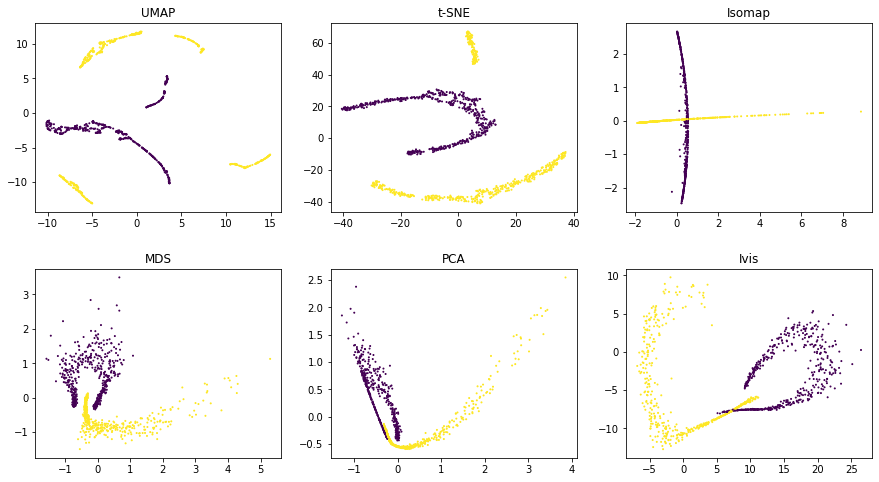

.. _comparisons:

Comparing ivis with other dimensionality reduction algorithms
=============================================================

Ivis aims to reduce data dimensionality whilst preserving both global
and local structures. There are a number of real-world applications
where this feature could be useful. For example:

-  Anomaly detection
-  Biological interpretation of high-throughput experiments
-  Feature extraction

Several algorithms have been proposed to address the problem of
dimensionality reduction, including
`UMAP <https://umap-learn.readthedocs.io/en/latest/>`__ and
`t-SNE <https://lvdmaaten.github.io/tsne/>`__. UMAP in particular, has
been succesfully applied in machine learning pipelines. Ivis is
different to these approaches in several ways.

First, ``ivis`` does not make any assumptions as to the inherent structure
of the dataset. Second, ``ivis`` is designed
to handle both small and extremely large datasets. Ivis performs well on
toy datasets such as the *iris* dataset, and scales linearly to datasets
with millions of observations. Indeed, we see that the main usecase for ``ivis`` are datasets with > 250,000 observations. Finally, ``ivis`` prioritises interpretation
over visual apperance - this is accomplished by imposing meaning to
distances between points in the embedding space. As such, ``ivis`` does not
create spurious clusters nor does it artificially pack clusters closer
together. Embeddings aim to be true to the original structure of the
data, which can be noisy in a real-world setting.

Visual Assessment
------------------

We will visually examine how popular dimensionality reduction algorithms
- UMAP, t-SNE, Isomap, MDS, and PCA - approach two synthetic datasets
with 5,000 observations in each. Since we are concerned with a
dimensionality reduction problem, we will artificially add reduntant
features to the original datasets using polynomial combinations (degree
≤ 10) of the original features.

Random Noise
~~~~~~~~~~~~

To start, let's examine how various dimensionality reduction methods behave in the presence of random noise. We generated 5000 uniformly distributed random points in a two-dimensional space and expanded the feature set using polynomial combinations. In all cases default parameters were used to fit multiple models.

.. image:: _static/random_projections_benchmaks.png

Both ``ivis`` and PCA reliably recovered the random nature of our dataset. Conversely, Isomap, UMAP, and t-SNE appeared to back certain points together, creating an impression of clusters within uniform random noise.

Structured Datasets
~~~~~~~~~~~~~~~~~~~

Next, we examine how well global features of a dataset, such as relative position of clusters, can be recovered in a low-dimensional space.

Using default parameters, we can see that ``ivis`` succesfully captures both
the general structure of each half-moon, as well as their relative
positions to one another. Both UMAP and t-SNE appear to introduce
spurious clusters and global relationships between the half-moons appear
to be disrupted.

.. image:: _static/comparisons_swiss_roll.png 

Similarly as above, UMAP and t-SNE appear to generate a large number of small clusters along
the continuous distribution of the dataset. Although the global
structure is relatively well-preserved. ``ivis`` maintains both global and
local structures of the dataset.

Quantitative Evaluation
-----------------------

To measure how well each algorithm preserves global distances, we examined correlation between points in the original dataset and the embedding space. For this analysis, 10,000 observations were chosen from the `Levine dataset <https://github.com/lmweber/benchmark-data-Levine-32-dim>`__ (104,184 x 32) using random uniform sampling. Box plots represent distances across pairs of points in the embeddings, binned using 50 equal-width bins over the pairwise distances in the original
space. Pearson correlation coefficients were also computed over the pairs of distances.

 .. image:: _static/comparisons_ivis_umap_levine_distances.png 

 ``ivis`` appeared to preserve both a small-, mid-, and large-scale  L1 and L2 distances, whilst UMAP and t-SNE seemed to ignore mid- to large-scale distances. Interestingly, ``ivis`` was particularly good at preserving L2 distances in low-dimensional space.
