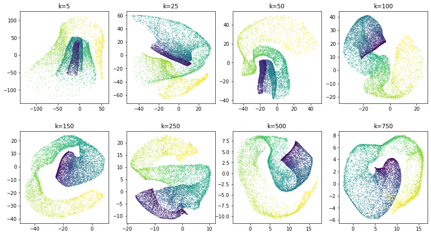
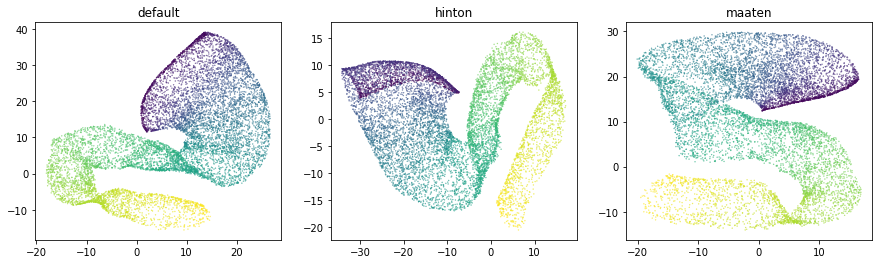

.. _hyperparameters:

Hyperparameter Selection
========================

``ivis`` uses several hyperparameters that can have an impact on the desired embeddings:

-  ``embedding_dims``: Number of dimensions in the embedding space.
-  ``k``: The number of nearest neighbours to retrieve for each point.
-  ``n_epochs_without_progress``: After n number of epochs without an improvement to the loss, terminate training early.
-  ``model``: the keras model that is trained using triplet loss. If a
   model object is provided, an embedding layer of size
   ``embedding_dims`` will be appended to the end of the network. If a
   string is provided, a pre-defined network by that name will be used.
   Possible options are: 'default', 'hinton', 'maaten'. By default, a
   selu network composed of 3 dense layers of 128 neurons each will be
   created, followed by an embedding layer of size 'embedding\_dims'.

``k`` , ``n_epochs_without_progress``, and ``model`` are tunable parameters that should be selected on
the basis of dataset size and complexity. We will look at each of these
parameters in turn.

.. code:: ipython3

    import matplotlib.pyplot as plt
    import mpl_toolkits.mplot3d.axes3d as p3
    
    from sklearn.datasets.samples_generator import make_swiss_roll
    from sklearn.preprocessing import PolynomialFeatures, MinMaxScaler
    
    from sklearn.manifold import TSNE
    from sklearn.decomposition import PCA
    
    import keras
    import pydot as pyd
    from IPython.display import SVG
    from keras.utils.vis_utils import model_to_dot
    
    keras.utils.vis_utils.pydot = pyd
    
    from ivis import Ivis
    from ivis.nn.network import base_network

The Swiss Roll dataset with 10,000 points will be used to demonstrate
the effects of ``k`` and ``model`` on embeddings.

.. note::
  Our aim is not to unfold the data in the Swiss Roll, but rather recover original structure from high-dimensional feature set.

.. code:: ipython3

    X, y = make_swiss_roll(n_samples=10000, noise=0.05)
    X_poly = PolynomialFeatures(10).fit_transform(X)
    X_poly = MinMaxScaler().fit_transform(X_poly)

Since ``ivis`` is a dimensionality reduction algorithm, we will
artificially add reduntant features to the original three-dimensional
Swiss Roll dataset using polynomial combinations (degree ≤ 10) of the
original features.
   

.. code:: ipython3

    fig = plt.figure(figsize=(14, 10))
    ax = fig.add_subplot(1, 1, 1, projection='3d')
    
    ax.view_init(7, -65)
    ax.scatter(X[:, 0], X[:, 1], X[:, 2],
                   c = y,
                   s=1)
    ax.set_title('Original')

``k``
-----

This parameter controls the balance between local and global features of
the dataset. Low ``k`` values will result in prioritisation of local
dataset features and the overall global structure may be missed.
Conversely, high ``k`` values will force ``ivis`` to look at broader
aspects of the data, losing desired granularity. We can visualise
effects of low and large values on ``k`` on the Swiss Roll dataset.

.. code:: ipython3

    k = [5, 25, 50, 100, 150, 250, 500, 750]
    embeddings = {}
    for nn in k:
        ivis = Ivis(k=nn, model = 'maaten').fit(X_poly)
        embeddings[nn] = ivis.transform(X_poly)

.. code:: ipython3

    fig, axs = plt.subplots(2, 4, figsize=(15, 8), facecolor='w', edgecolor='k')
    fig.subplots_adjust(hspace = 0.3, wspace = 0.2)
    
    axs = axs.ravel()
    for i, nn in enumerate(k):
        xy=embeddings[nn]
        axs[i].scatter(xy[:, 0], xy[:, 1], s = 0.1, c = y)
        axs[i].set_title('k='+str(nn))
        

We can see that with small values of ``k`` (<100), the spiraling
structure of the Swiss Roll Dataset is not recovered. Emphasis is placed
on grouping similar points together rather than extracting original
dataset structure.

For larger values of ``k`` (≥500), the overall shape of the dataset is
preserved, but individual points that make up the Swiss Roll tend to be
localised to the peripheries.

In our experiments, we observed that setting ``k`` values to 0.01%-1%
of the number of observations consistently results in greater embedding
accuracies. Therefore, for a dataset with 10,000 observations ``k=15``
is a sensible default.

``n_epochs_without_progress``
-----------------------------

This patience hyperparameter impacts both the quality of embeddings and speed with which they are generated. Generally, the higher ``n_epochs_without_progress`` are, the more accurate are the low-dimensional features. However, this comes at a computational cost. Here we examine, the speed vs. accuracy trade-off and recommend sensible defaults. For this experiment ``ivis`` hyperparameters were set to ``k=15`` and ``model='maaten'``.

Three datasets were used `Levine <https://github.com/lmweber/benchmark-data-Levine-32-dim>`__ (104,184 x 32), `MNIST <https://www.openml.org/d/554>`__ (70,000 x 784), and `Melanoma <https://portals.broadinstitute.org/single_cell/study/SCP11/melanoma-intra-tumor-heterogeneity>`__ (4,645 x 23,686). The Melanoma featurespace was further reduced to n=50 using Principal Component Analysis.

For each dataset, we trained a Support Vector Machine classifier to assess how well ``ivis`` embeddings capture manually supplied response variable information. For example, in case of an MNIST dataset, the response variable is the digit label, whilst for Levine and Melanoma datasets it is the cell type. SVM classifier was trained on  ``ivis`` embeddings representing 3%, 40%, and 95% of the data obtained using a stratified random subsampling. The classifier was then validated on the ``ivis`` embeddings of the remaining 97%, 60%, and 5% of data. For each training set split, an ``ivis`` model was trained by keeping the ``k`` and ``model`` hyperparameters constat, whilst varying ``n_epochs_without_progress``. Finally, classification accuracies were noramlised to a 0-1 range to facilitate comparisons between datasets.

.. image:: _static/ivis_patience_boxplots.png

Our final results indicate that oveall accuracy of embeddings is a function of dataset size and ``n_epochs_without_progress``. However, only marginal gain in performance is achieved when ``n_epochs_without_progress>20``. For large datasets (``n_observations>10000``), ``n_epochs_without_progress`` between 3 and 5 comes to within 85% of optimal classification accuracy.

``model``
---------

The ``model`` hyperparameter is a powerful way for ``ivis`` to handle
complex non-linear feature-spaces. It refers to a trainable neural
network that learns to minimise a triplet loss loss function.
Structure-preserving dimensionality reduction is achieved by creating
three replicates of the baseline architecture and assembling these
replicates using a `siamese neural
network <https://en.wikipedia.org/wiki/Siamese_network>`__ (SNNs). SNNs
are a class of neural network that employ a unique architecture to
naturally rank similarity between inputs. The ivis SNN consists of three
identical base networks; each base network is followed by a final
embedding layer. The size of the embedding layer reflects the desired
dimensionality of outputs.

.. image:: _static/FigureS1.png

``model`` parameter is defined using a `keras
model <https://keras.io>`__. This flexibility allows ivis to be trained
using complex architectures and patterns, including convolutions. Out of
the box, ivis supports three styles of baseline architectures -
**default**, **hinton**, and **maaten**. This can be passed as string
values to the ``model`` parameter.

'default'
~~~~~~~~~

The **default** network has three dense layers of 128 neurons followed by a
final embedding layer (128-128-128). The size of the embedding layer reflects 
the desired dimensionality of outputs. The layers preceding the embedding
layer use the SELU activation function, which gives the network a
self-normalizing property. The weights for these layers are randomly
initialized with the LeCun normal distribution. The embedding layers use
a linear activation and have their weights initialized using Glorot’s
uniform distribution.

'hinton'
~~~~~~~~

The **hinton** network has three dense layers (2000-1000-500) followed
by a final embedding layer. The size of the embedding layer reflects the
desired dimensionality of outputs. The layers preceding the embedding
layer use the SELU activation function. The weights for these layers are
randomly initialized with the LeCun normal distribution. The embedding
layers use a linear activation and have their weights initialized using
Glorot’s uniform distribution.

'maaten'
~~~~~~~~

The **maaten** network has three dense layers (500-500-2000) followed by
a final embedding layer. The size of the embedding layer reflects the
desired dimensionality of outputs. The layers preceding the embedding
layer use the SELU activation function. The weights for these layers are
randomly initialized with the LeCun normal distribution. The embedding
layers use a linear activation and have their weights initialized using
Glorot’s uniform distribution.

Let's examine each architectural option in greater detail:

.. code:: ipython3

    architecture = ['default', 'hinton', 'maaten']
    embeddings = {}
    for a in architecture:
        ivis = Ivis(k=150).fit(X_poly)
        embeddings[a] = ivis.transform(X_poly)

.. code:: ipython3

    fig, axs = plt.subplots(1, 3, figsize=(15, 4), facecolor='w', edgecolor='k')
    fig.subplots_adjust(hspace = 0.3, wspace = 0.2)
    
    axs = axs.ravel()
    for i, nn in enumerate(architecture):
        xy=embeddings[nn]
        axs[i].scatter(xy[:, 0], xy[:, 1], s = 0.1, c = y)
        axs[i].set_title(nn)

Selecting an appropriate baseline architecture is a data-driven task.
Three unique architectures that are shipped with ivis perform
consistently well across a wide array of tasks. A general rule of thumb
in our own experiments is to use the **default** network for
computationally-intensive processing on large datasets (>1 million
observations) and select **maaten** architecture for smaller real-world
datasets.
