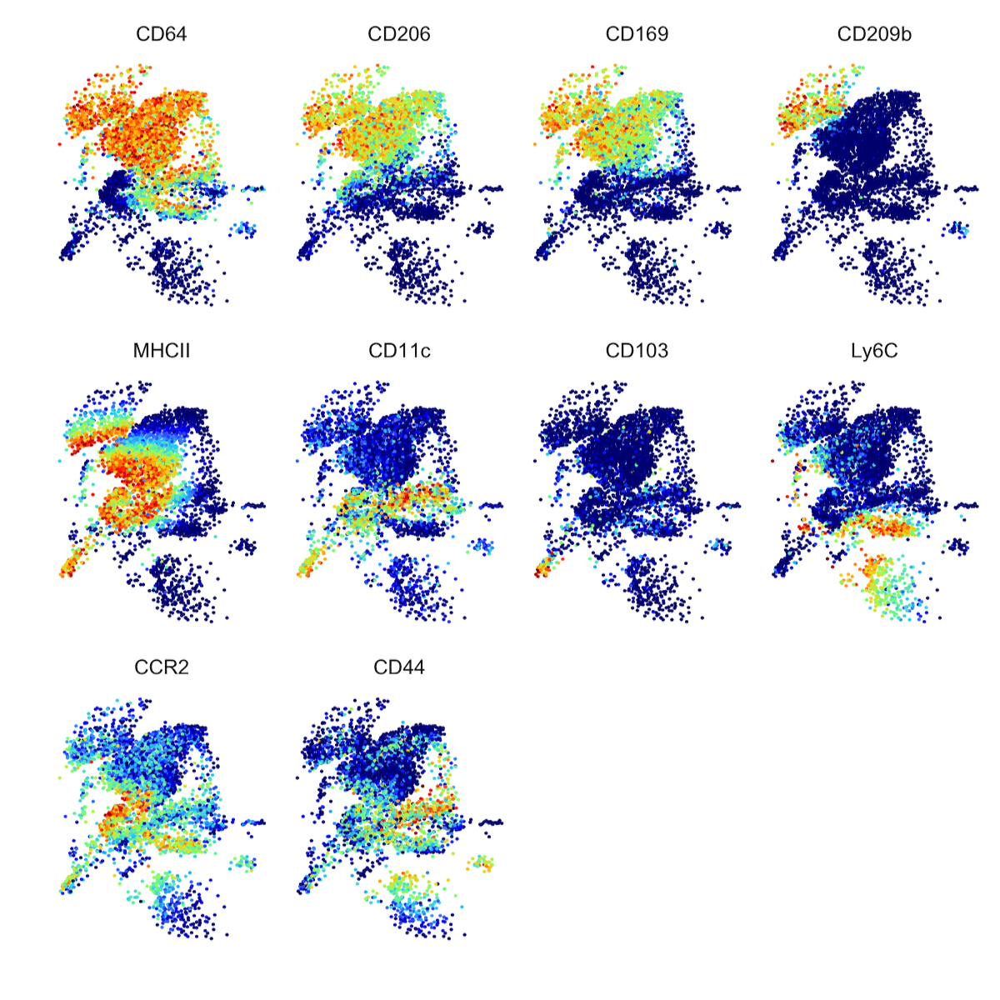
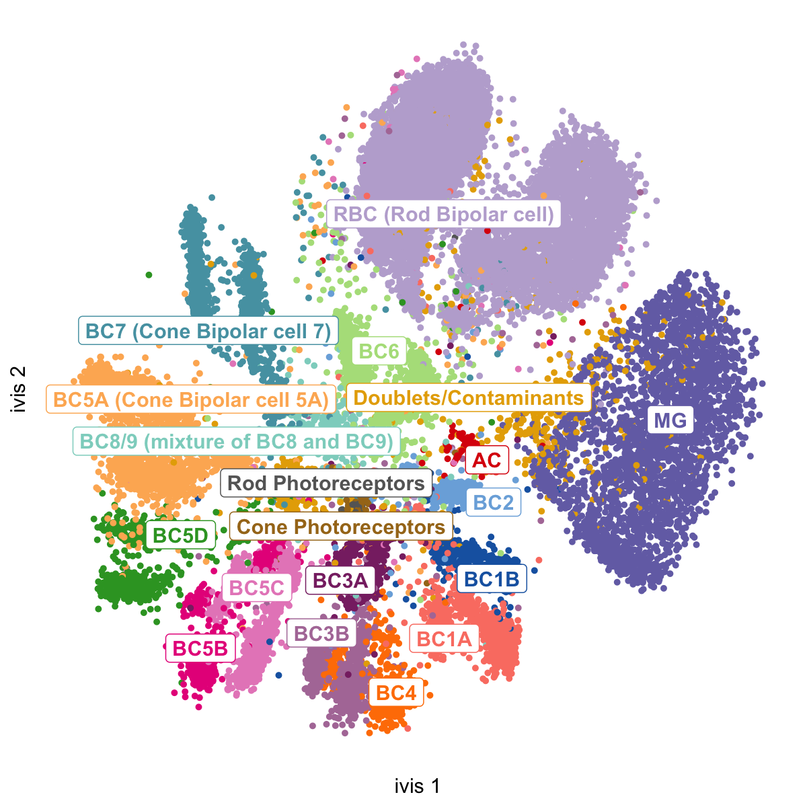

.. ivis documentation master file, created by
   sphinx-quickstart on Sun May 19 17:35:22 2019.
   You can adapt this file completely to your liking, but it should at least
   contain the root `toctree` directive.

ivis: structure preserving dimensionality reduction
===================================================

|fig1| |fig2|

``ivis`` is a machine learning algorithm for reducing dimensionality of very large datasets. ``ivis`` preserves global data structures in a low-dimensional space, adds new data points to existing embeddings using a parametric mapping function, and scales linearly to millions of observations. The algorithm is described in detail in `Structure-preserving visualisation of high dimensional single-cell datasets <https://www.nature.com/articles/s41598-019-45301-0>`_.

The latest development version is on `github <https://github.com/beringresearch/ivis>`_.

.. toctree::
   :maxdepth: 2
   :caption: User Guide:

   Installation <installation>
   Quickstart <quickstart>
   Hyperparameter Selection <hyperparameters>
   Supervised Dimensionality Reduction <supervised>
   Callbacks <callbacks>
   Examples <auto_examples/index>

.. toctree::
  :maxdepth: 2
  :caption: Applications:
   
  Dimensionality Reduction <comparisons>

.. toctree::
    :maxdepth: 2
    :caption: Benchmarks:

    Speed of Execution <timings_benchmarks>
    Distance Preservation <embeddings_benchmarks>

.. toctree::
  :maxdepth: 2
  :caption: API Reference:

   API Guide <api>
