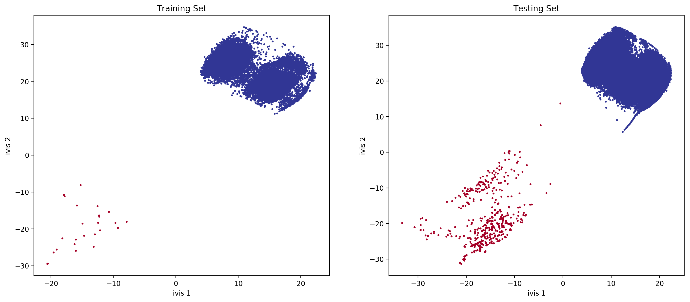

.. _metric_learning:

Metric Learning with Application to Supervised Anomaly Detection
================================================================

Introduction
------------

Metric Learning
~~~~~~~~~~~~~~~

Metric Learning is a machine learning task that aims to learn a distance
function over a set of observations. This can be useful in a number of
applications, including clustering, face identification, and
recommendation systems.

``ivis`` was developed to address this task using
concepts of the Siamese Neural Networks. In this example, we will
demonstrate that Metric Learning using ``ivis`` can effectively deal
with class imbalance, yielding features resulting in state-of-the-art
classification performance.

Supervised Dimensionality Reduction
~~~~~~~~~~~~~~~~~~~~~~~~~~~~~~~~~~~

``ivis`` is able to make use of any provided class labels to perform
supervised dimensionality reduction. Supervised embeddings combine the
distance-based characteristics of the unsupervised ``ivis`` algorithm
with clear class boundaries between the class categories. This is
achieved by simultaneously minimising the tripplet loss and softmax loss
functions. The resulting embeddings encode relevant class-specific
information into lower dimensional space. It is possible to control the
relative importance ``ivis`` places on class labels when training in
supervised mode with the ``supervision_weight`` parameter. This
variable should be a float between 0.0 to 1.0, with higher values
resulting in classification affecting the training process more, and
smaller values resulting in it impacting the training less. By default,
the parameter is set to 0.5. Increasing it to 0.8 will result in more
cleanly separated classes.

Results
-------

Data Selection
~~~~~~~~~~~~~~

In this example we will make use of the `Credit Card Fraud Dataset <https://www.kaggle.com/mlg-ulb/creditcardfraud>`_. The datasets contains transactions made by credit cards in September 2013 by european cardholders. This dataset presents transactions that occurred in two days, where we have 492 frauds out of 284,807 transactions. The dataset is highly unbalanced, the positive class (frauds) account for 0.172% of all transactions. Traditional supervised classification approaches would typically balance the training dataset either by over-sampling the minority class or down-sampling the majority class. Here, we investigate how ``ivis`` handles class embalance.

Data Preparation
~~~~~~~~~~~~~~~~

.. code:: python

    import pandas as pd
    import matplotlib.pyplot as plt
    
    from sklearn.preprocessing import StandardScaler, MinMaxScaler
    from sklearn.model_selection import train_test_split
    from sklearn.metrics import confusion_matrix, average_precision_score, roc_auc_score, classification_report
    from sklearn.linear_model import LogisticRegression
    
    from ivis import Ivis

.. code:: python

    data = pd.read_csv('../input/creditcard.csv')
    Y = data['Class']

The Credit Card Fraud dataset is highly skewed, consisting of 492 frauds
in a total of 284,807 observations (0.17% fraud cases). The features
consist of numerical values from the 28 ‘Principal Component Analysis
(PCA)’ transformed features, as well as Time and Amount of a
transaction.

In this analysis we will train ``ivis`` algorithm using a 5% stratified
subsample of the dataset. Our previous experiments have shown that
``ivis`` can yield >90% accurate embeddings using just 1% of the total
data.

.. code:: python

    train_X, test_X, train_Y, test_Y = train_test_split(data, Y, stratify=Y,
                                                        test_size=0.95, random_state=1234)

Next, because ``ivis`` will learn a distance over observations, scaling
must be applied to features. Additionally, transforming the data to a
range [0, 1] allows the neural network to extract more meaningful
features.

.. code:: python

    standard_scaler = StandardScaler().fit(train_X[['Time', 'Amount']])
    train_X.loc[:, ['Time', 'Amount']] = standard_scaler.transform(train_X[['Time', 'Amount']])
    test_X.loc[:, ['Time', 'Amount']] = standard_scaler.transform(test_X[['Time', 'Amount']])
    
    minmax_scaler = MinMaxScaler().fit(train_X)
    train_X = minmax_scaler.transform(train_X)
    test_X = minmax_scaler.transform(test_X)

Dimensionality Reduction
~~~~~~~~~~~~~~~~~~~~~~~~

Now, we can run ``ivis`` using default hyperparameters for supervised
embedding problems:

.. code:: python

    ivis = Ivis(embedding_dims=2, model='maaten',
                k=15, n_epochs_without_progress=5,
                supervision_weight=0.80,
                verbose=0)
    ivis.fit(train_X, train_Y.values)

.. code:: python

    ivis.save_model('ivis-supervised-fraud')

Finally, let’s embed the training set and extrapolate learnt embeddings
to the testing set.

.. code:: python

    train_embeddings = ivis.transform(train_X)
    test_embeddings = ivis.transform(test_X)

Visualisations
~~~~~~~~~~~~~~

.. code:: python

    fig, ax = plt.subplots(1, 2, figsize=(17, 7), dpi=200)
    ax[0].scatter(x=train_embeddings[:, 0], y=train_embeddings[:, 1], c=train_Y, s=3, cmap='RdYlBu_r')
    ax[0].set_xlabel('ivis 1')
    ax[0].set_ylabel('ivis 2')
    ax[0].set_title('Training Set')
    
    ax[1].scatter(x=test_embeddings[:, 0], y=test_embeddings[:, 1], c=test_Y, s=3, cmap='RdYlBu_r')
    ax[1].set_xlabel('ivis 1')
    ax[1].set_ylabel('ivis 2')
    ax[1].set_title('Testing Set')

With anomalies being shown in red, we can see that ``ivis``:

1. Effectively learnt embeddings in an unbalanced dataset.
2. Succesfully extrapolated learnt metrics to a testing subset.

Linear Classifier
~~~~~~~~~~~~~~~~~

We can train a simple linear classifier to assess how well ``ivis``
learned the class representations.

.. code:: python

    clf = LogisticRegression(solver="lbfgs").fit(train_embeddings, train_Y)

.. code:: python

    labels = clf.predict(test_embeddings)
    proba = clf.predict_proba(test_embeddings)

.. code:: python

    print(classification_report(test_Y, labels))
    
    print('Confusion Matrix')
    print(confusion_matrix(test_Y, labels))
    print('Average Precision: '+str(average_precision_score(test_Y, proba[:, 1])))
    print('ROC AUC: '+str(roc_auc_score(test_Y, labels)))

.. parsed-literal::

                precision    recall  f1-score   support

             0       1.00      1.00      1.00    270100
             1       1.00      0.99      1.00       467

      accuracy                           1.00    270567
     macro avg       1.00      1.00      1.00    270567
  weighted avg       1.00      1.00      1.00    270567

  Confusion Matrix
  [[270100      0]
  [     3    464]]
  Average Precision: 0.9978643591710002
  ROC AUC: 0.9967880085653105

Conclusions
-----------

``ivis`` effectively learns a distance metric over an unbalanced
dataset. The resulting feature set can be used with a simple linear
model classifier to achieve state-of-the-art performance on a
classification task.
