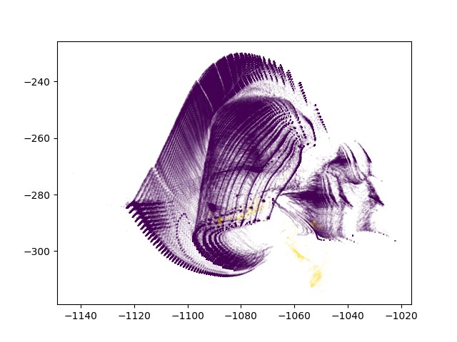

.. _oom_datasets:

Training ``ivis`` on Out-of-memory Datasets
================================================================

Introduction
------------

Out-of-memory Datasets
~~~~~~~~~~~~~~~~~~~~~~

Some datasets are so large that it becomes infeasible to load them into
memory all at the same time. Other visualisation techniques might only
be able to run on a smaller subset of the data; however, this runs the
risk of potentially missing out on important smaller patterns in the data.

``ivis`` was developed to address the issue of dimensionality reduction in very large datasets
through batch-wise training of the neural network on data stored HDF5 format.
Since training occurs in batches, the whole dataset does not need to
be loaded into memory at once, and can instead be loaded from disk in
chunks. In this example, we will show how ``ivis`` can scale up and
be used to visualize massive datasets that don't fit into memory.

Example
-------

Data Selection
~~~~~~~~~~~~~~

In this example we will make use of the
`KDD Cup 1999 dataset <http://kdd.ics.uci.edu/databases/kddcup99/kddcup99.html>`_. Although the dataset can be easily read-in to RAM, it provides a toy example for a general use case.
The KDD99 dataset contains network traffic, with the competition task being
to detect network intruders. The dataset is unbalanced, with the majority of
traffic being normal.

Data Preparation
~~~~~~~~~~~~~~~~

To train ``ivis`` on an out-of-memory dataset, the dataset must first be
converted into the ``h5`` file format. There are numerous methods of doing
this using various external tools such as `Apache Spark <https://spark.apache.org>`_. In this example, we will assume that
the dataset has already been preprocessed and converted to .h5 format.

Dimensionality Reduction
~~~~~~~~~~~~~~~~~~~~~~~~

To train on a h5 file that exists on disk, we can use a Keras utility
class, the ``HDF5Matrix`` class. This will allow us to run ``ivis``
on the HDF5Matrix object using the ``fit`` method. We will train
``ivis`` in unsupervised mode for 5 epochs to speed up training;
other hyperparameters are left at their default values.

.. note:: When training on a h5 dataset, we recommend to use the ``shuffle_mode='batch'`` option in the ``fit`` method. This will speed up the training process by pulling a batch of data from disk and shuffling that batch, rather than shuffling across the whole dataset.

.. code:: python

    from keras.utils.io_utils import HDF5Matrix

    X = HDF5Matrix(h5_filepath, 'data')
    y = HDF5Matrix(h5_filepath, 'labels')

    model = Ivis(epochs=5)
    model.fit(X, shuffle_mode='batch') # Shuffle within batches when using h5 files

    y_pred = model.transform(X)

Visualisations
~~~~~~~~~~~~~~

.. code:: python

    plt.figure()
    plt.scatter(x=y_pred[:, 0], y=y_pred[:, 1], c=y)
    plt.set_xlabel('ivis 1')
    plt.set_ylabel('ivis 2')
    plt.show()

With anomalies being shown in yellow, we can see that ``ivis`` is able to pin point anomalous observations. 

Conclusions
-----------

``ivis``
is able to scale and deal with the massive, out-of-memory datasets
found in the real world by training directly on h5 files. Additionally, it can effectively learn
embeddings in an unbalanced dataset without labels.
