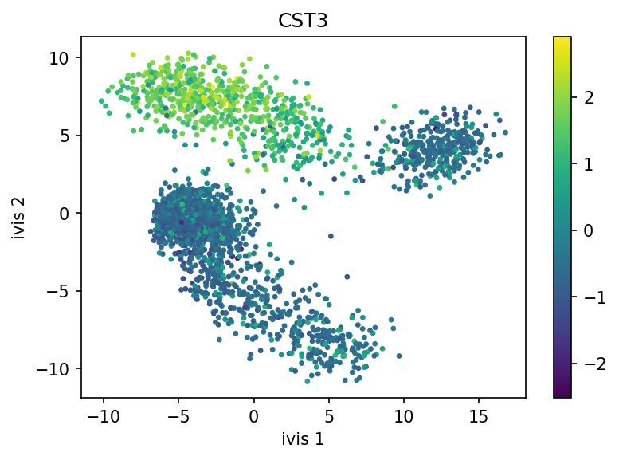

.. _scanpy_singlecell:

Using ``ivis`` for Dimensionality Reduction of Single Cell Experiments
======================================================================

This example will demonstrate how ``ivis`` can be used to visualise
single cell experiments. Data import, preprocessing and normalisation
are handled by the `Scanpy module <https://scanpy.readthedocs.io/>`__.
The data that will be used in this example consists of 3,000 PBMCs from a
healthy donor and is freely available from 10x Genomics. Now, let’s
download the data and get started.

.. code:: bash

    mkdir data
    wget http://cf.10xgenomics.com/samples/cell-exp/1.1.0/pbmc3k/pbmc3k_filtered_gene_bc_matrices.tar.gz -O data/pbmc3k_filtered_gene_bc_matrices.tar.gz
    cd data; tar -xzf pbmc3k_filtered_gene_bc_matrices.tar.gz    

.. code:: python

    import numpy as np
    import pandas as pd
    import scanpy as sc
    
    sc.settings.verbosity = 3
    sc.logging.print_versions()
    results_file = './write/pbmc3k.h5ad'

    adata = sc.read_10x_mtx(
        './data/filtered_gene_bc_matrices/hg19/',  # the directory with the `.mtx` file
        var_names='gene_symbols',                  # use gene symbols for the variable names (variables-axis index)
        cache=True)                                # write a cache file for faster subsequent reading

We can now carry out basic filtering and handling of mitochondrial
genes:

.. code:: python

    adata.var_names_make_unique()
    sc.pp.filter_cells(adata, min_genes=200)
    sc.pp.filter_genes(adata, min_cells=3)

    mito_genes = adata.var_names.str.startswith('MT-')
    # for each cell compute fraction of counts in mito genes vs. all genes
    # the `.A1` is only necessary as X is sparse (to transform to a dense array after summing)
    adata.obs['percent_mito'] = np.sum(
        adata[:, mito_genes].X, axis=1).A1 / np.sum(adata.X, axis=1).A1
    # add the total counts per cell as observations-annotation to adata
    adata.obs['n_counts'] = adata.X.sum(axis=1).A1

    adata = adata[adata.obs['n_genes'] < 2500, :]
    adata = adata[adata.obs['percent_mito'] < 0.05, :]

Let’s normalise the data and apply log-transformation:

.. code:: python

    sc.pp.normalize_per_cell(adata, counts_per_cell_after=1e4)
    sc.pp.log1p(adata)
    adata.raw = adata

Identify highly-variable genes and do the filtering:

.. code:: python

    sc.pp.highly_variable_genes(adata, min_mean=0.0125, max_mean=3, min_disp=0.5)

    adata = adata[:, adata.var['highly_variable']]

    sc.pp.regress_out(adata, ['n_counts', 'percent_mito'])

 
It’s recommended to apply PCA-transformation of normalised data - this
step tends to denoise the data.

.. code:: python

    sc.pp.scale(adata, max_value=10)
    sc.tl.pca(adata, svd_solver='arpack')

Reducing Dimensionality Using ``ivis``
--------------------------------------

.. code:: python

    import matplotlib.pyplot as plt
    from ivis import Ivis

For most single cell datasets, the following hyperparameters can be
used:

-  ``k=15``
-  ``model='maaten'``
-  ``n_epochs_without_progress=5``

.. note:: Keep in mind that this is a very small experiment (<3000 observations) and there are plenty of fast and accurate algorithm designed for these kinds of datasets e.g. UMAP. However, if you have >250,000 cells, ``ivis`` considerably outperforms state-of-the-art both in speed and accuracy of embeddings. See our :ref:`timings benchmarks <timings_benchmarks>` for more information on this.

.. code:: python

    X = adata.obsm['X_pca']
    
    ivis = Ivis(k=15, model='maaten', n_epochs_without_progress=5)
    ivis.fit(X)
    embeddings = ivis.transform(X)

Finally, let’s visualise our embeddings, coloured by the CST3 gene!

.. code:: python

    fill = adata.X[:, adata.var.gene_ids.index=='CST3']
    fill = fill.reshape((X.shape[0], ))

.. code:: python

    plt.figure(figsize=(6, 4), dpi=150)
    sc = plt.scatter(x=embeddings[:, 0], y=embeddings[:, 1], c=fill, s=5)
    plt.xlabel('ivis 1')
    plt.ylabel('ivis 2')
    plt.title('CST3')
    plt.colorbar(sc)

``ivis`` effectively captured three distinct cellular populations in this small dataset. Note that ``ivis`` is an “honest” algorithm and distances between observations are meaningful. Our benchmarks show that ``ivis`` is ~10% better at preserving local and global distances in low-dimensional space than comparable state-of-the-art algorithms. Additionally, ``ivis`` is robust against noise and outliers, ulike t-SNE, which tends to group random noise into well-defined clusters that can be potentially misleading.

