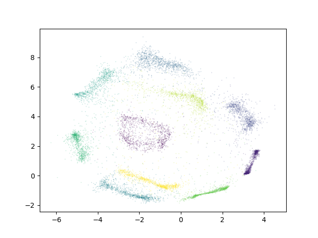
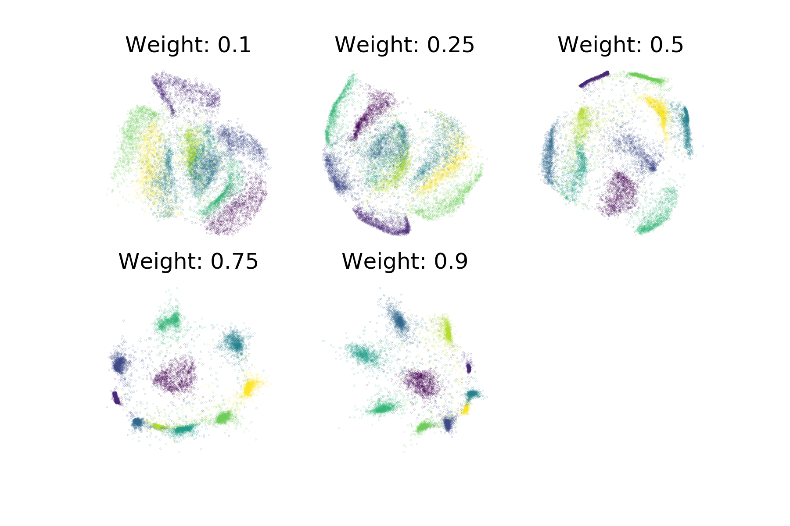
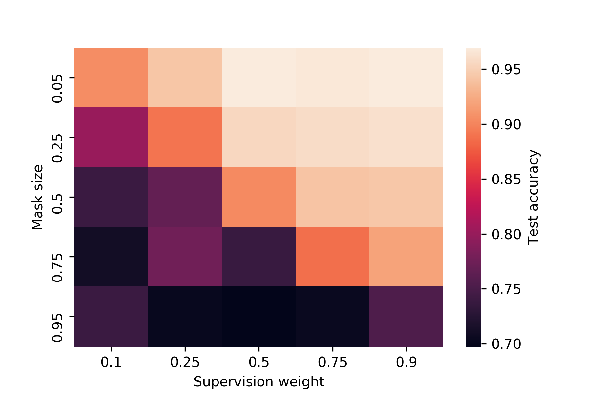

.. _semi_supervised:

Semi-supervised Dimensionality Reduction
===================================

Sometimes only part of a dataset has ground-truth labels available. 
In such a scenario, ``ivis`` is still able to make use of existing 
label information in conjunction with the inputs to do 
dimensionality reduction when in semi-supervised mode. 
When in semi-supervised mode, ``ivis`` will use labels when available 
as well as the unsupervised triplet loss. However, when label 
information is not available, only the unsupervised loss will be used. 
By training in semi-supervised mode, we can make full use of the data 
available, even if it is only partially labeled.

In order to use semi-supervised learning, mark missing labeled points 
as -1 in the Y vector provided to ``ivis`` when calling `fit` or 
`fit_transform`. Currently, only `sparse_categorical_crossentropy` loss 
works with semi-supervised inputs. 

Semi-supervised Classification
--------------

To train ``ivis`` in semi-supervised mode using the default softmax
classification loss, simply provide the labels to the fit method's
``Y`` parameter. These labels should be a list of 0-indexed
integers with each integer corresponding to a class. Missing labels 
should be denoted with -1.

In the example below, we will mask 50% of the available labels for the 
MNIST dataset.

::

    import numpy as np
    from tensorflow.keras.datasets import mnist
    from ivis import Ivis

    (X_train, Y_train), (X_test, Y_test)  = mnist.load_data()

    # Rescale to [0,1]
    X_train = X_train / 255.
    X_test = X_test / 255.

    # Flatten images to 1D vectors
    X_train = np.reshape(X_train, (len(X_train), 28 * 28))
    X_test = np.reshape(X_test, (len(X_test), 28 * 28))

    # Mask labels
    mask = np.random.choice(range(len(Y_train)), size=len(Y_train) // 2, replace=False)
    Y_train_masked = np.array(Y_train, dtype=np.int8) # Can't use uint to represent negative numbers
    Y_train_masked[mask] = -1

    model = Ivis(n_epochs_without_progress=5)
    model.fit(X_train, Y_train_masked)

Experimental data has shown that ``ivis`` converges to a solution faster
in supervised mode. Therefore, our suggestion is to lower the value of
the ``n_epochs_without_progress`` parameter from the default to
around 5. Here are the resulting embeddings on the testing set:

Supervision Weight
------------------

As in supervised mode, it is still possible to control the relative
importance ``ivis`` places on the labels when training in supervised mode with the
``supervision_weight`` parameter. This variable should be a float
between 0.0 to 1.0, with higher values resulting in supervision
affecting the training process more, and smaller values resulting in it
impacting the training less. By default, the parameter is set to 0.5.
Increasing it will result in more cleanly separated classes.

::

    weight = 0.8
    model = Ivis(n_epochs_without_progress=5,
                 supervision_weight=weight)
    model.fit(X_train, Y_train)

As an illustration of the impact the ``supervision_weight`` has on
the resulting embeddings, see the following plot of supervised ``ivis``
applied to MNIST with different weight values:

In semi-supervised mode, the supervision weight may need to be higher to have the same effect 
on the resulting embeddings as in supervised mode, depending on the dataset. 
This is because when unlabeled points are encountered, unsupervised loss will still 
have an impact, while the supervised loss will not apply. The more of the dataset is 
unlabeled, the higher the supervision weight should be to have an impact on the embeddings.

