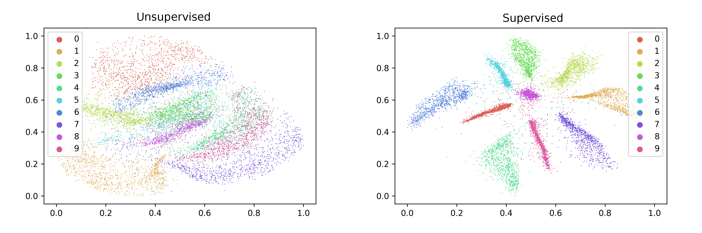
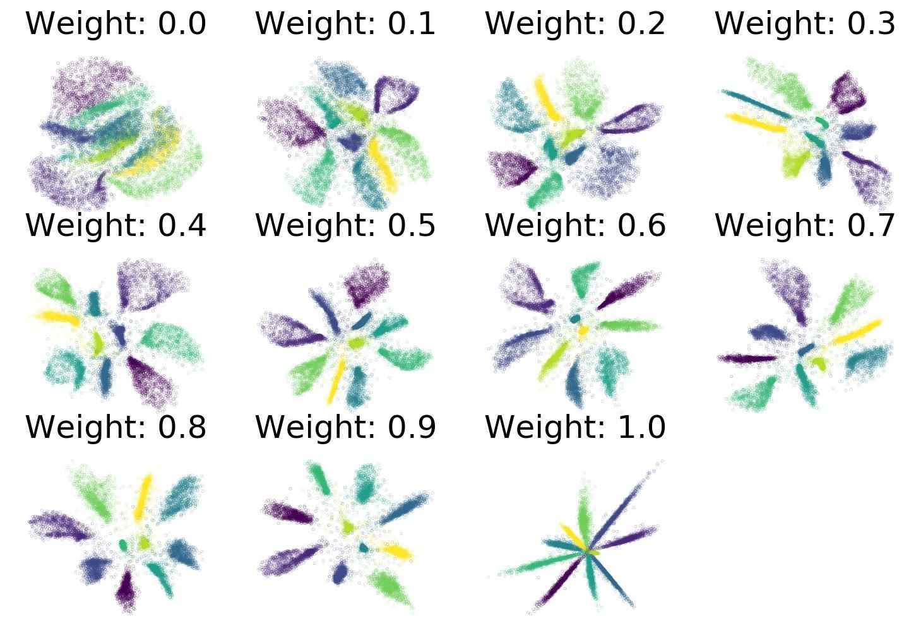
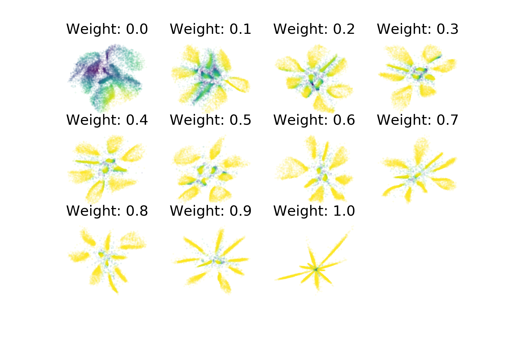
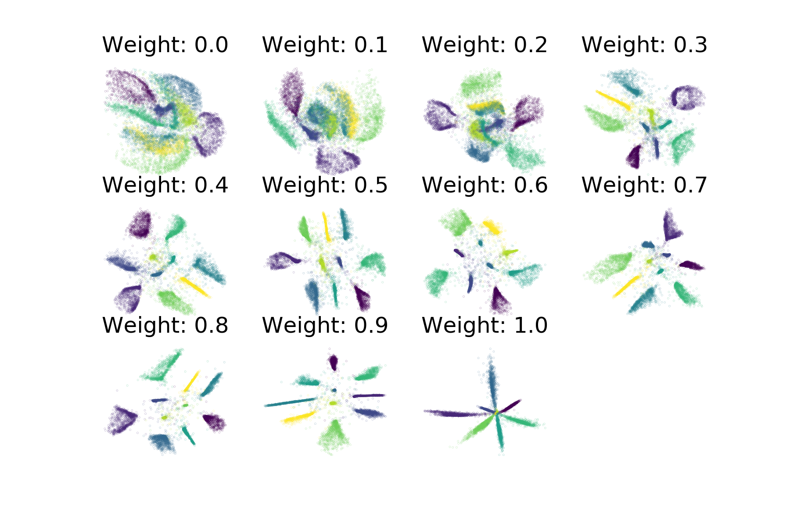
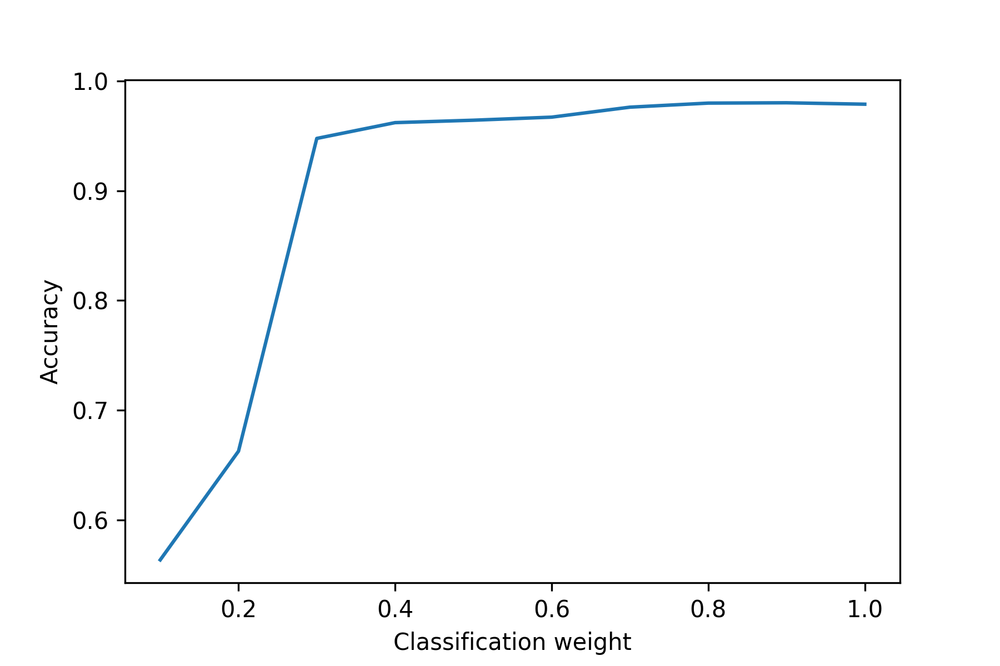
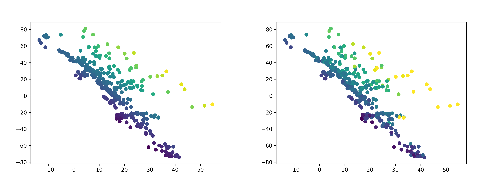
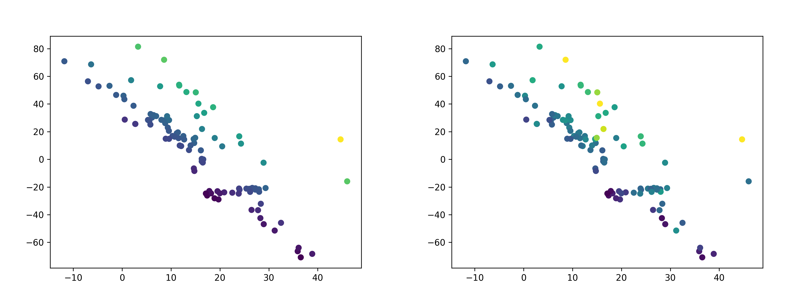

.. _supervised:

Supervised Dimensionality Reduction
===================================

``ivis`` is able to make use of any provided class labels to perform
supervised dimensionality reduction. Supervised embeddings can
combine the distance-based characteristics of the unsupervised ``ivis``
algorithm with clear class boundaries between the class categories when trained
to classify inputs simulateously to embedding them. The
resulting embeddings encode relevant class-specific information into
lower dimensional space, making them useful for enhancing the
performance of a classifier.

Many supervision metrics are available; for instance, it is also possible
to perform supervised training on continous labels, by providing a regression
metric to the ``supervision_metric`` parameter when constructing an Ivis obect.
``ivis`` supports the use of any of the classification or regression
losses included with keras, so long as the labels are provided in the
correct format.

Generating Embeddings with Supervised ``ivis``
----------------------------------------------

To train ``ivis`` in supervised mode using the default softmax
classification loss, simply provide the labels to the fit method's
``Y`` parameter. These labels should be a list of 0-indexed
integers with each integer corresponding to a class.

::

    import numpy as np
    from keras.datasets import mnist
    from ivis import Ivis

    (X_train, Y_train), (X_test, Y_test)  = mnist.load_data()

    # Rescale to [0,1]
    X_train = X_train / 255.
    X_test = X_test / 255.

    # Flatten images to 1D vectors
    X_train = np.reshape(X_train, (len(X_train), 28 * 28))
    X_test = np.reshape(X_test, (len(X_test), 28 * 28))

    model = Ivis(n_epochs_without_progress=5)
    model.fit(X_train, Y_train)

Experimental data has shown that ``ivis`` converges to a solution faster
in supervised mode. Therefore, our suggestion is to lower the value of
the ``n_epochs_without_progress`` parameter from the default of 50 to
around 5. Here are the resulting embeddings:

It is possible to control the relative importance Ivis places on the
labels when training in supervised mode with the
``supervision_weight`` parameter. This variable should be a float
between 0.0 to 1.0, with higher values resulting in supervision
affecting the training process more, and smaller values resulting in it
impacting the training less. By default, the parameter is set to 0.5.
Increasing it to 0.8 will result in more cleanly separated classes.

::

    weight = 0.8
    model = Ivis(n_epochs_without_progress=5,
                 supervision_weight=weight)
    model.fit(X_train, Y_train)

As an illustration of the impact the ``supervision_weight`` has on
the resulting embeddings, see the following plot of supervised ``ivis``
applied to MNIST with different weight values:

Obtaining Classification Probabilities
--------------------------------------

Since training ``ivis`` in supervised mode causes the algorithm to optimize
the supervised objective in conjunction with the triplet loss function, it is
possible to obtain the outputs of the supervised network using the
``score_samples`` method. These may be useful for assessing the quality of
the embeddings by examining the performance of the classifier, for example,
or for predicting the labels for unseen data.

::

    weight = 0.8
    model = Ivis(n_epochs_without_progress=5,
                 supervision_weight=weight)
    model.fit(X_train, Y_train)

    embeddings = model.transform(X_test)
    y_pred = model.score_samples(X_test)

As before, we can train several supervised ``ivis`` models on the MNIST
dataset, varying the supervision_weight parameter, coloring the plots
according to the max of the returned softmax probabilities.

Coloring by the max softmax probabilities shows the degree of certainty in
the supervised network's predictions - areas that are yellow are predicted with
a higher degree of confidence while those in blue and green have a lower degree
of confidence. With low supervision weight, more of the data is classified
with a low degree of certainty. Additionally, points floating in the centre
between clusters tend to have lower class predictions associated with them.

We also checked the accuracy of the ivis classifiers when used to predict
the test set labels across the different supervision weights. In general,
increasing the supervision weight improved the classifier's predictive
performance on the test set, with maximum performance achieved with a
weight of 0.9. At this weight the triplet loss continues to have
a small regularizing effect on the results, which may improve the
generalizability of the classifier compared to a pure softmax classifier.

.. image:: _static/accuracy-classification-weight-zoomed.png

Linear-SVM classifier
---------------------

It's also possible to utilize different supervised metrics to train the
supervised network by adjusting the ``supervsed_metric`` parameter.
By selecting ``categorical_hinge`` it is possible
to optimize a linear SVM on the data in conjunction with the triplet loss.

Below is an example of training ``ivis`` in supervised mode in tandem with
a linear SVM on the Fashion MNIST dataset.
Note that the ``categorical_hinge`` loss function expects one-hot encoded
labels. We can achieve this using the ``to_categorical`` function from
keras utils.

::

    from keras.datasets import mnist
    from keras.utils import to_categorical
    from ivis import Ivis
    import numpy as np

    (X_train, Y_train), (X_test, Y_test) = mnist.load_data()

    # Flatten images
    X_train = np.reshape(X_train, (len(X_train), 28 * 28)) / 255.
    X_test = np.reshape(X_test, (len(X_test), 28 * 28)) / 255.

    # One-hot encode labels
    Y_train = to_categorical(Y_train)
    Y_test = to_categorical(Y_test)

    model = Ivis(n_epochs_without_progress=5,
                 supervision_metric='categorical_hinge')
    model.fit(X_train, Y_train)

    embeddings = model.transform(X_test)
    y_pred = model.score_samples(X_test)

The resulting embeddings show ivis trained with a
Linear SVM using the ``categorical_hinge`` metric over a variety of
supevision_weight values. The maximum achieved accuracy on the test
set was 98.02% - once again, a supervision weight of 0.9 led to the
highest classification performance.

Supervised Regression
---------------------

It is also possible to perform supervised training on continous labels.
To do this, a regression metric should be provided to ``supervision_metric``
when constructing the Ivis object. Many of these exist in Keras, including
mean-absolute-error, mean-squared error, and logcosh.

In the example below, ``ivis`` is trained on the boston housing dataset using
the mean-absolute-error supervised metric (mae).

::

    from ivis import Ivis
    from keras.datasets import boston_housing
    import numpy as np

    (X_train, Y_train), (X_test, Y_test) = boston_housing.load_data()

    supervision_metric = 'mae'
    ivis_boston = Ivis(k=15, batch_size=16, supervision_metric=supervision_metric)
    ivis_boston.fit(X_train, Y_train)

    train_embeddings = ivis_boston.transform(X_train)
    y_pred_train = ivis_boston.score_samples(X_train)

    test_embeddings = ivis_boston.transform(X_test)
    y_pred_test = ivis_boston.score_samples(X_test)

The embeddings on the training set are shown below. On the left
are the embeddings are colored by the ground truth label;
the right is colored by predicted values. There is a high degree
of correlation between the predicted and actual values, with an
R-squared value of 0.82.

The embeddings on the test set are below. Again, the left
is colored by the ground truth label, while the right is colored
by predicted values. There is a also a high degree
of correlation between the predicted and actual values on the test set,
although it is lower than on the training set - the R-squared value is 0.63.

