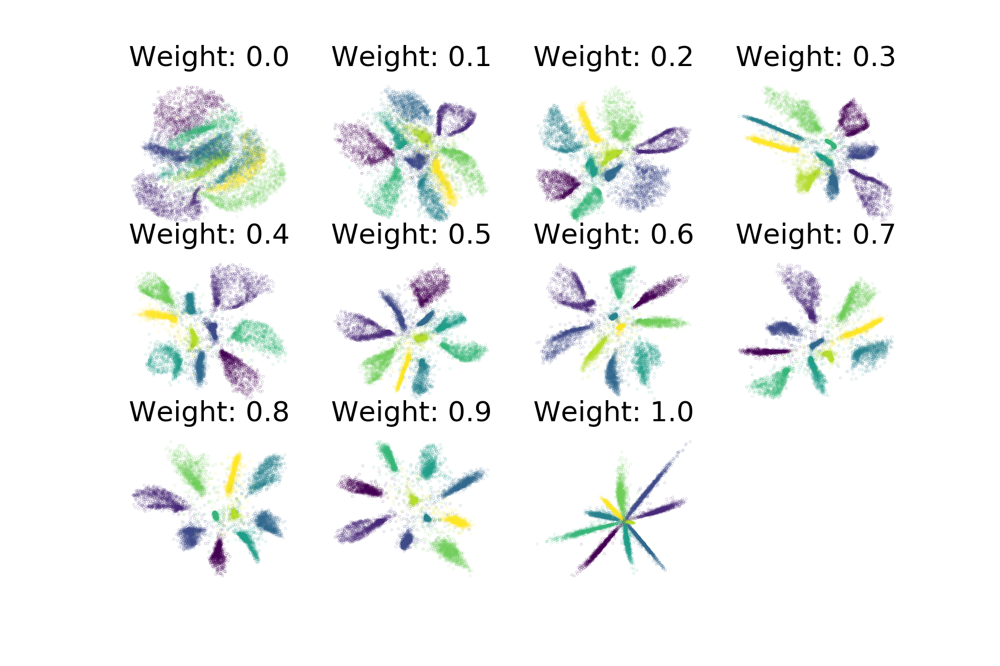

.. _supervised:

ivis Supervised Dimensionality Reduction
========================================

``ivis`` is able to make use of any provided class labels to perform
supervised dimensionality reduction. The resulting embeddings will
combine the distance-based characteristics of the unsupervised ``ivis``
algorithm with clear class boundaries between the class categories. The
resulting embeddings encode relevant class-specific information into
lower dimensional space, making them useful for enhancing the
performance of a classifier.

To train ``ivis`` is supervised mode, simply provide the labels to the
fit method's ``Y`` parameter. These labels should be a list of 0-indexed
integers with each integer corresponding to a class.

::

    from keras.datasets import mnist
    import numpy as np

    (X_train, Y_train), (X_test, Y_test)  = mnist.load_data()

    # Rescale to 0-1
    X_train = X_train / 255.
    X_test = X_test / 255.

    # Flatten images to 1D vectors
    X_train = np.reshape(X_train, (len(X_train), 28 * 28))
    X_test = np.reshape(X_test, (len(X_test), 28 * 28))

    model = Ivis(n_epochs_without_progress=5)
    model.fit(X_train, Y_train)

Experimental data has shown that ``ivis`` converges to a solution faster
in supervised mode. Therefore, our suggestion is to lower the value of
the ``n_epochs_without_progress`` parameter from the default of 50 to
around 5. Here are the resulting embeddings:

.. image:: _static/mnist-embedding-comparison_titled.png

It is possible to control the relative importance Ivis places on the
labels when training in supervised mode with the
``classification_weight`` parameter. This variable should be a float
between 0.0 to 1.0, with higher values resulting in classification
affecting the training process more, and smaller values resulting in it
impacting the training less. By default, the parameter is set to 0.5.
Increasing it to 0.8 will result in more cleanly separated classes.

::

    weight = 0.8
    model = Ivis(n_epochs_without_progress=5,
                 classification_weight=weight)
    model.fit(X_train, Y_train)

As an illustration of the impact the ``classification_weight`` has on 
the resulting embeddings, see the following plot of supervised ivis 
applied to MNIST with different weight values:

