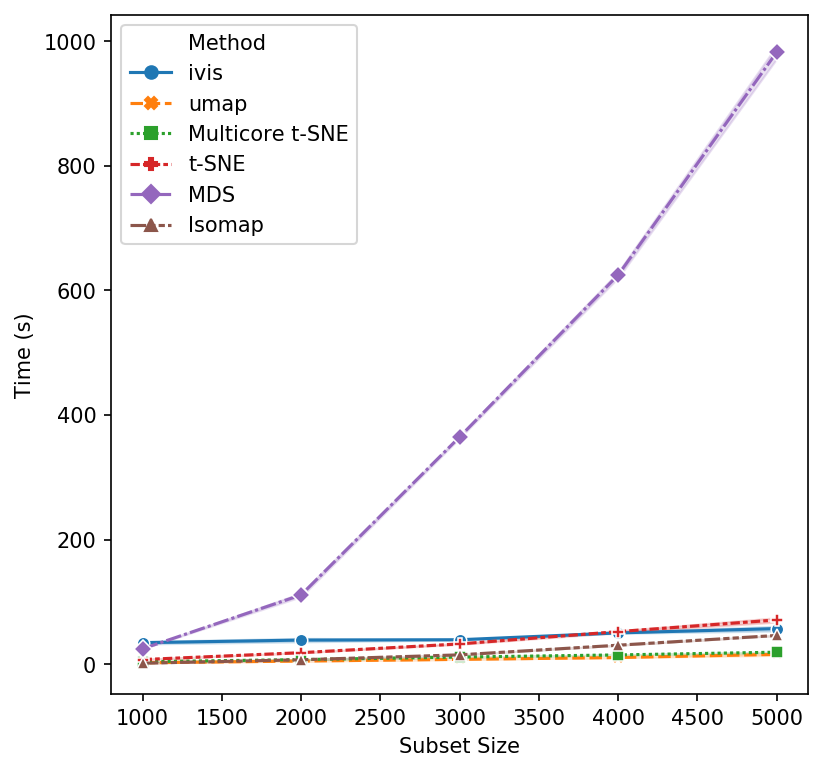
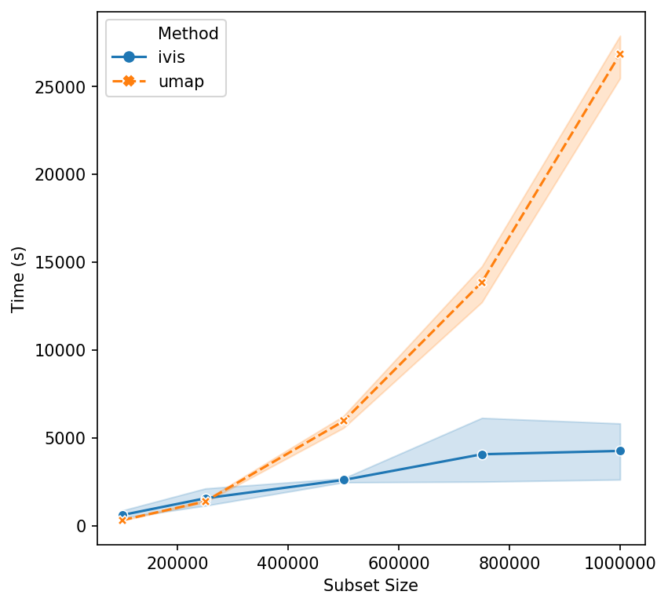

.. _timings_benchmarks:

Ivis Runtime Benchmarks
=======================

Real-world datasets are becoming increasingly complex, both due to the number of observations and the ever-growing feature space. For example, single cell experiments can easily monitor 20,000 features across 1,000,000 observations.

Dimensionality reduction (DR) algorithms enable useful exploration of feature-rich datasets. Nevertheless, each algorithm has different computational complexity that impacts its real-world use case. We will now investigate how runtime performance of the ``ivis`` algorithm scales with increasing dataset size.

Algorithm implementation has significant impact on performance. In these experiments, we will use mainly `scikit-learn <http://scikit-learn.org>`_ implementation, with the exception of `multicore t-SNE <https://github.com/DmitryUlyanov/Multicore-TSNE>`_. Two benchmark datasets will be used to asses runtimes: MNIST (up to 70,000 observations) and the first 1,000,000 integers represented as `binary vectors indicating their prime factors <https://johnhw.github.io/umap_primes/index.md.html>`_. For all algorithms, default settings were adopted. Ivis hyperparameters were fixed to: ``embedding_dims=2``, ``k=15``, ``model=’default’``, and ``n_epochs_without_progress=3``. Our previous experiments have shown that these defaults yield accurate embeddings.

Subsamples were created using scikit-learn's ``resample`` method, producing stratified random sub-samples. For each run, three random subsamples were generated to create a distribution of values.

Effects of Data Size on Performance
-----------------------------------

We begin with small subsample sizes – 1,000 to 5,000 observation. It becomes clear that MDS will be not usable as we increase data sizes. Additionally, scikit-learn implementation of t-SNE is beginning to slow down as we approach 5,000 subsamples. UMAP and multicore t-SNE perform very well.

That’s a reasonable start - let’s increase the subset size. Isomap and scikit-learn’s implementation of t-SNE seem to have reached their performance threshold and are now experiencing considerable slow down. ``ivis`` appears to be on-par with multicore t-SNE, albeit a little faster, whilst UMAP is the winner hands down!

.. image:: _static/ivis_timings_5000_20000.png

Now, let’s push beyond toy datasets and examine sizes that are more likely to be encountered in real-world problems. For this experiment we generated 1,000,000 integers (observations) with corresponding binary vectors indicating their prime factors (features). We immediately see that ``ivis`` is fast. Additionally, whilst UMAP timings increase exponentially, ``ivis`` execution speed does not change much on subsamples with greater than 750,000 observations.

We can conclude that for smaller datasets (< 100,000 observations), UMAP and multicore t-SNE are excellent options. However, ``ivis`` excels at dealing with very large datasets. Furthermore, ``ivis`` appears to :ref:`generate more accurate embeddings <embeddings_benchmarks>` – a perk that comes with a slightly longer runtime for smaller datasets.
